# Taste Mate

## React Hackathon Group Project (with Axios API)
### Team:
- [Christian Adams](https://github.com/connorreidy1)
- [Conner Reidy](https://github.com/Zekkune)
- [Stephanie Cancel](https://github.com/persefy)

Using ['TheMealDB' API](https://themealdb.com/api.php)

## Summary:
Team of 3 created a React app, pulling data from an external API using axios.
Features:
- Search bar to search by meal name
- - search results page
- Navigation menu to display by category
- - catergory results page
- Meal details page

Languages/Tools:
- React (useEffect,useState,useContext,Routes/Link,useNavigate, etc.)
- JavaScript
- HTML
- CSS
- Axios

## Component Hierarchy
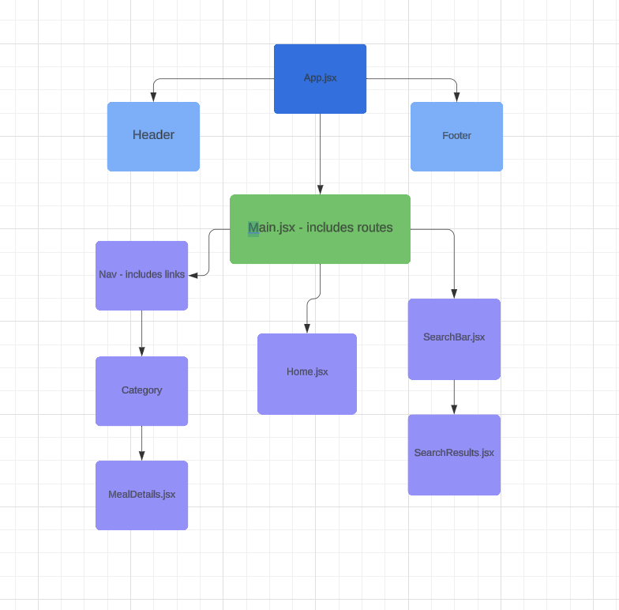

## Figma Wireframes
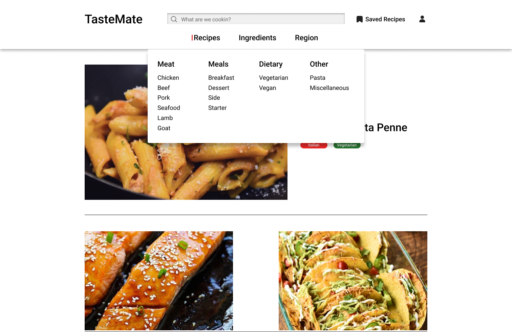{:width="20px}
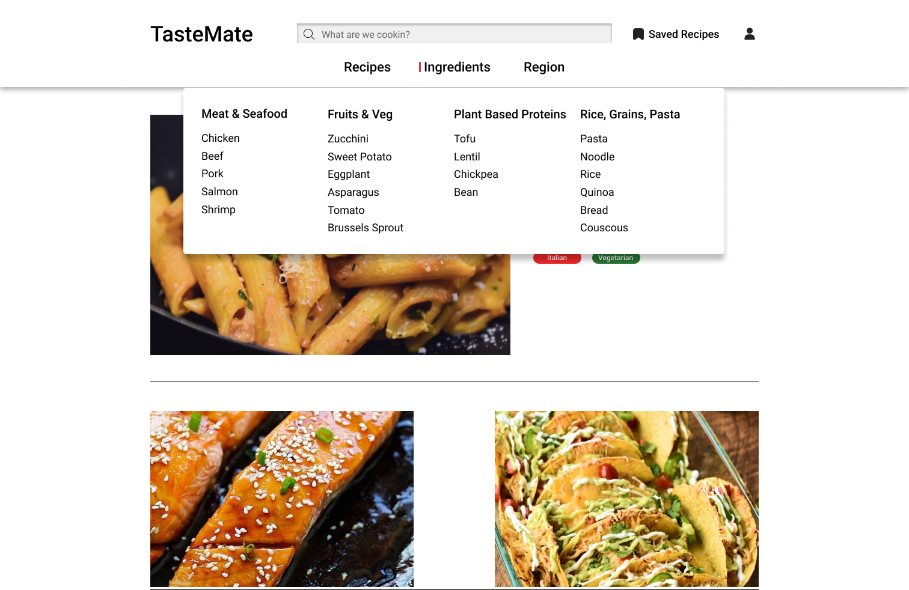
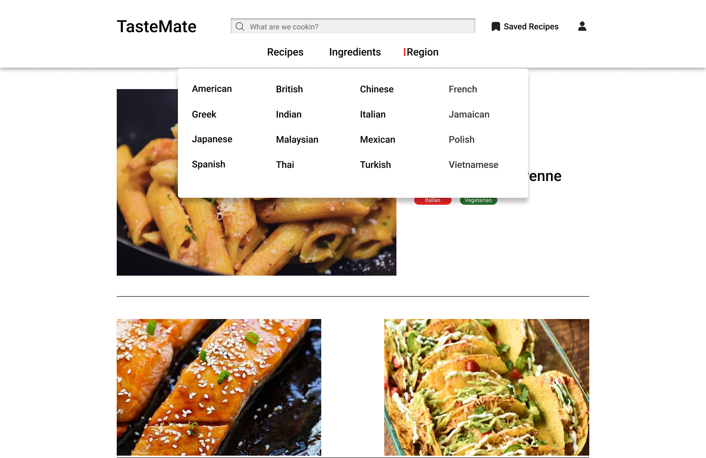
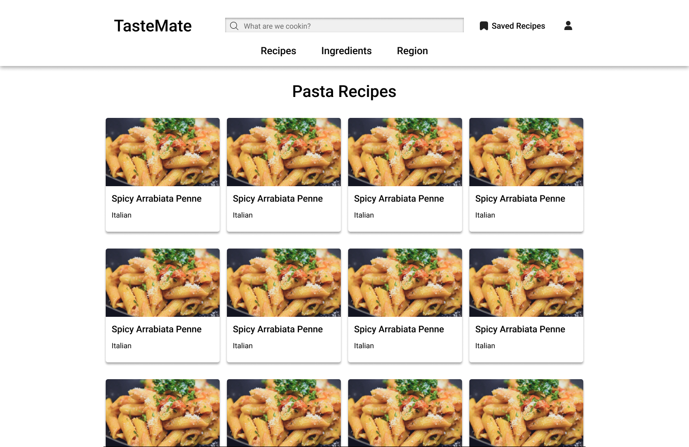
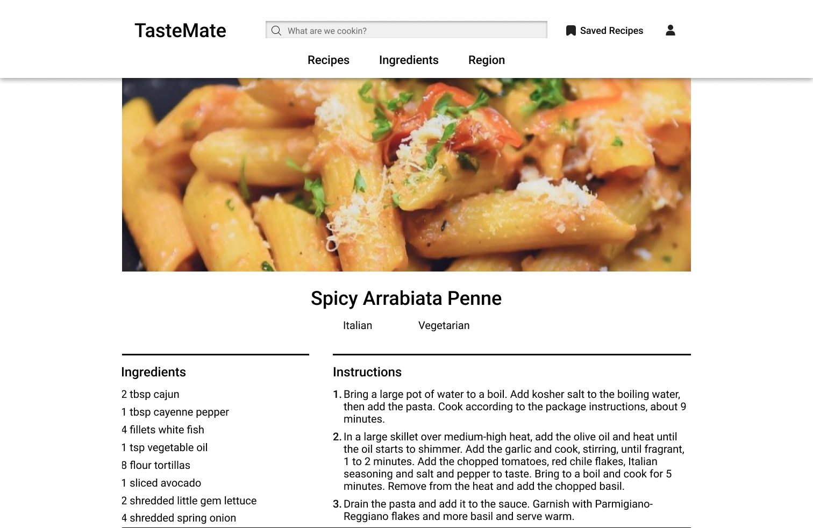
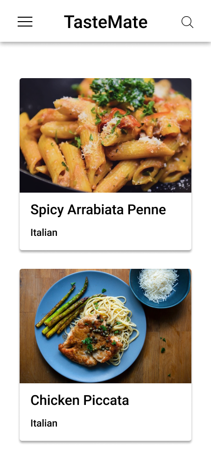
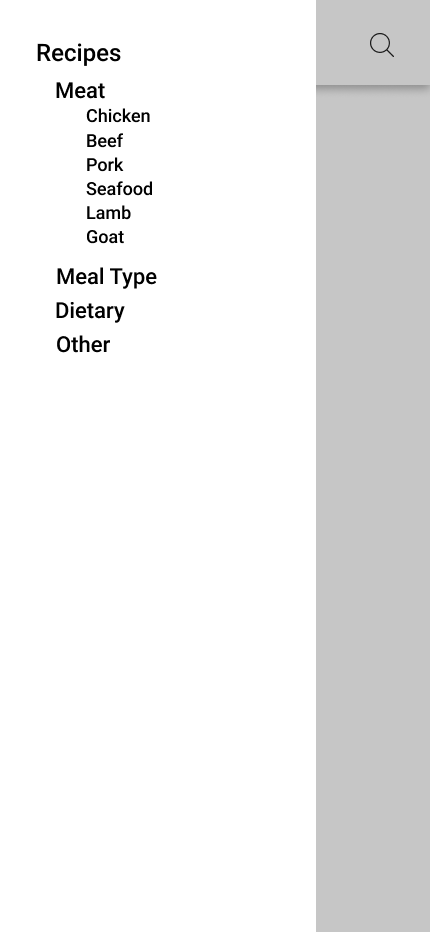
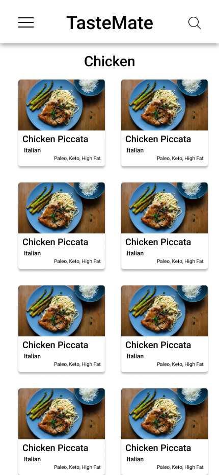

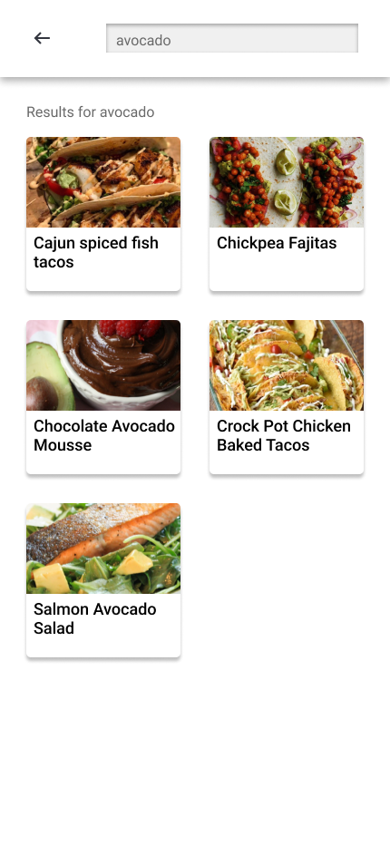
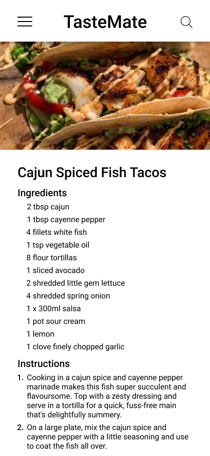

### Team:
- [Christian Adams](https://github.com/connorreidy1)
- [Conner Reidy](https://github.com/Zekkune)
- [Stephanie Cancel](https://github.com/persefy)